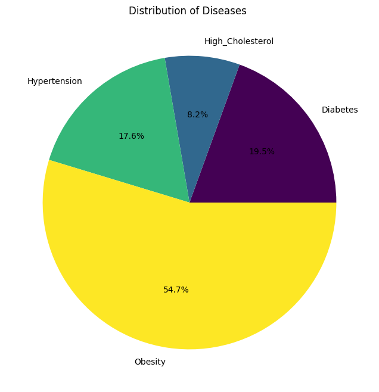

# Predictive-Analysis-Project


## 📌Project Overview

This project aims to develop a predictive analytics model using comprehensive health and nutrition data for the US population.

By leveraging machine learning and LLM (DeepSeek V3), we analyze public health trends, predict disease risks, and study the impact of lifestyle factors.

## 📂 Dataset

**Dataset Name**: CDC National Health and Nutrition Examination Survey (NHANES)

**Source**: [CDC NHANES Dataset](https://www.kaggle.com/datasets/cdc/national-health-and-nutrition-examination-survey/data)

**Description**: The dataset includes various health indicators such as BMI, blood pressure, glucose levels, dietary habits, and demographic information.

## 🛠️ Tools & Technology Stack

🚀 Programming Language:
- Python 3.11

📚 Libraries:

- Data Handling: pandas, numpy
- Data Visualization: seaborn, matplotlib
- Machine Learning: scikit-learn,

## Setup and Installation

### 1️⃣ Create and Activate a Virtual Environment

It is recommended to use a virtual environment to manage dependencies:

```bash
# Create a virtual environment
python -m venv venv  

# Activate the virtual environment
# Windows:
venv\Scripts\activate

# macOS/Linux:
source venv/bin/activate
```
### 2️⃣ Install Required Dependencies

Run the following command to install all necessary libraries:

```bash
pip install -r requirements.txt
```
### 3️⃣ Download the NHANES Dataset

Download the dataset from [NHANES](https://www.kaggle.com/datasets/cdc/national-health-and-nutrition-examination-survey/data) and place it in the datasets/ directory.

### 4️⃣ Run the Project

run your all shell of **predictiveAnalysis.ipynb** (remember you have either jupyter notebook or extention of jupyter notebook and by that you can run with kernel)
## 📌 Project Workflow Documentation

###  1. Data Preprocessing
- Load the NHANES dataset.
- Handle missing values by filling or dropping them as required.
- Normalize and scale data for better model accuracy.
- Select key features such as BMI, age, gender, height, weight, blood pressure.

###  2. Exploratory Data Analysis (EDA)

- Use seaborn to visualize correlations between health indicators.
- Generate heatmaps to identify relationships between variables.
- Analyze distributions of BMI, blood pressure and different disease.
- Identify key health indicators affecting disease risks.

###  3. Model Training & Evaluation

- Train models for prediction(Random Forest Regressor(also there are other models like linear or logistic , etc and DeepSeek V3 LLM for advanced insights))
- Evaluate model performance using R² Score (Coefficient of Determination),Mean Absolute Error (MAE),Mean Squared Error (MSE)
- Compare performance to choose the best model for deployment.
###  4. Predictions & Insights
- Use trained models to predict disease risks based on health metrics.
- Analyze how different factors (e.g., height, age, weight) impact health trends.
- Generate insights and recommendations for improving public health.(use of DeepSeek model)

## 📝Project Progress

Currently it predict that that person's BMI and according that it return it's status which is either underweight or normal or overweight or obese.

As shown below:
```bash
📌 Predicted BMI: 24.48
🏥 Health Classification: Normal (Healthy Range)
```
For that we have get weight, height, age and gender from user. 

Also there are data visualization charts which shown that how accurate prediction is and how much have been error in prediction.

- There is pie chart of distribution of disease in data which is Analysis of human disease. 

As shown below:
<p align="center">
  
</p>

- You can see all data visualization in **predictiveAnalysis.ipynb** file

- If you have to make model more insightful then use DeepSeekv3 model which gives you in better way answer formats.